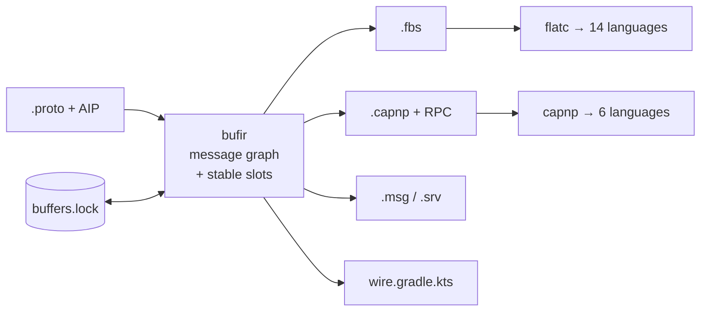

<h1 align="center">buffers</h1>

<p align="center">
  <strong>One AIP schema, every serialization surface.</strong> buffers is a
  <code>protoc</code> plugin and CLI that turns the AIP-annotated protobuf you
  already have into <strong>FlatBuffers</strong>, <strong>Cap'n Proto</strong>
  (with RPC), <strong>ROS 2</strong> and <strong>Square Wire</strong> — and pins
  every field to a target slot that does not move.
</p>

<p align="center">
  <a href="LICENSE"></a>
  
  
</p>

> [!CAUTION]
> Early development. The generated output may change between versions. Pin a
> release tag in CI, commit `buffers.lock`, and review the diff before shipping a
> regenerated schema.

## Contents

- [Why](#why)
- [The problem it actually solves](#the-problem-it-actually-solves)
- [Install](#install)
- [Quick start](#quick-start)
- [Targets](#targets)
- [Annotations](#annotations)
- [The ordinal ledger](#the-ordinal-ledger)
- [Architecture](#architecture)
- [What it does not do](#what-it-does-not-do)
- [Development](#development)

## Why

A robotics or trading stack rarely gets to pick one serialization format. gRPC
carries the control plane, a shared-memory bus carries the hot path, ROS carries
whatever the sensor vendor shipped, and the mobile client wants Kotlin. Each has
its own IDL, and the usual answer is to write the same types four times and hope
review catches the drift.

buffers takes the protobuf definition as the source of truth and derives the rest.
The AIP annotations that are already there — `google.api.resource`,
`field_behavior`, `resource_reference`, the AIP-131–136 method shapes — carry
enough information to do it without a second vocabulary describing the same
things again.



## The problem it actually solves

Converting between IDLs is the easy half. The hard half is that **a field's slot
is a wire format, and the numbering schemes do not match.**

Proto field numbers are 1-based and sparse. Cap'n Proto ordinals are 0-based and
contiguous. FlatBuffers ids are 0-based, contiguous, and consumed *two at a time*
by a union. So every target needs a mapping — and a mapping recomputed from
scratch on each run silently changes when somebody deletes a field:

```proto
message Sensor {
  string name     = 1;   // ordinal 0
  SensorKind kind = 2;   // ordinal 1
  string firmware = 5;   // ordinal 4   ← delete this
  float rate_hz   = 7;   // ordinal 5
}
```

Remove `firmware` without reserving it and `rate_hz` slides from ordinal 5 to 4.
Nothing reports it. Not protoc, not capnp, not flatc, not the consumer — which
was compiled against the old schema and now reads a `float` out of the slot that
used to hold a string.

buffers makes that visible three ways:

1. **Reserved ranges hold slots.** `reserved 5;` keeps ordinal 4 occupied, so
   nothing after it moves.
2. **An unreserved gap is a diagnostic** that names the exact line to add.
3. **`buffers.lock` records every assignment**, and `buffers verify` fails CI when
   a rebuild would move one.

```console
$ buffers verify
error: ordinal: sensors.v1.Sensor.rate_hz: buffers.lock records ordinal 6 for
       field number 7, but this build derives 5; the ledger wins, because a
       consumer compiled against 6 is still reading it
    fix: a field was probably removed without a `reserved` declaration — add it,
         and the two will agree again
```

## Install

```sh
go install github.com/the-protobuf-project/buffers/plugin/cmd/protoc-gen-buffers@latest
go install github.com/the-protobuf-project/buffers/plugin/cmd/buffers@latest
```

Compiling the emitted schema into a language additionally needs that format's
toolchain — `brew install flatbuffers capnp`. `buffers targets` reports what is
installed.

## Quick start

### As a buf plugin

```yaml
# buf.gen.yaml
version: v2
plugins:
  - local: protoc-gen-buffers
    out: schema/capnp
    opt:
      - target=capnp          # flatbuffers | capnp | ros | wire
      - lock=buffers.lock     # the ordinal ledger; commit it
      - strict=ordinal:error  # fail the build when a slot moves
```

### As a CLI

The CLI does strictly more: it compiles the protos itself, renders every target in
one pass, and drives flatc and capnp afterwards.

```sh
buffers init                    # write a starter buffers.yaml
buffers generate                # render every configured target
buffers generate --lang cpp     # ... and compile the schema
buffers verify                  # CI: fail if a slot would move
buffers targets                 # what can be emitted, what is installed
```

Point it at a buf-built descriptor set whenever the protos depend on anything buf
resolves — googleapis, a BSR module — because buf has already done the resolution:

```sh
buf build proto -o descriptors.binpb --as-file-descriptor-set
```

## Targets

| Target | Emits | Toolchain | Languages |
|---|---|---|---|
| `flatbuffers` | `.fbs` | `flatc` | **cpp, csharp, dart, go, java, kotlin, kotlin-kmp, lobster, lua, nim, php, python, rust, swift, ts** |
| `capnp` | `.capnp` + RPC interfaces | `capnp` + a `capnpc-<lang>` plugin | c++, go, rust, java, kotlin, python, ts, csharp |
| `ros` | `.msg`, `.srv`, `topics.yaml` | rosidl, via colcon | c, cpp, python |
| `wire` | `wire.gradle.kts`, `Topics.kt` | Wire, via Gradle | kotlin, java, swift |

### Picking a target for a language

`buffers targets` prints this for your machine, including which `capnpc-*`
plugins are actually installed and how to get the ones that are not.

| Language | Reach it via |
|---|---|
| Go, Rust, Python, Java, Kotlin | `flatbuffers` or `capnp` |
| **Swift, Dart** | `flatbuffers` — no Cap'n Proto generator exists for either |
| C++ | `flatbuffers`, `capnp`, or `ros` |
| C#, TypeScript, PHP, Lua, Nim, Lobster | `flatbuffers` (or `capnp` for C#/TS) |

FlatBuffers is the broadest and the one to reach for when a project needs a
language the others do not have. Every entry in its row was verified by running
`flatc` against this repository's own emitted schema, not copied from
documentation.

Cap'n Proto ships **only** its C++ generator; every other language is a separate
`capnpc-<lang>` binary you install. `buffers` checks for it before invoking capnp
and reports the install line rather than letting capnp fail with a bare exec
error.

### Output layout

Generated language code is laid out the way protoc lays out its own: paths
mirroring the proto source tree, and packages taken from the proto's own
`java_package` / `go_package` rather than the bare proto package.

```
proto/sensors/v1/sensors.proto
  ->  cpp/sensors/v1/sensors_generated.h        namespace sensors::v1
      go/sensorsv1/Sensor.go                    package sensorsv1
      java/com/sensors/v1/Sensor.java           package com.sensors.v1
      python/sensors/v1/Sensor.py
```

That takes per-directory invocation, because flatc is really two behaviours: Go,
Java, Kotlin and Python build a tree from the schema namespace, while C++, Rust,
Swift and Dart emit one flat file per schema with the namespace inside the file.
Left alone, the second group drops every schema in a tree into a single directory,
where same-named files collide. `buffers` compiles those per source directory and
passes `--keep-prefix` so the generated `#include`s still resolve across the
result — a tree that looks right but does not build is the failure mode here, and
there is a test that compiles it.

**Go file names are snake_case.** flatc writes one file per generated *type*, in
PascalCase — `Sensor.go`, `CreateSensorRequest.go` — where Go uses lowercase
snake_case. `buffers` renames them afterwards, so you get `sensor.go` and
`create_sensor_request.go`.

The rename is safe because **a Go file name means nothing to the compiler**: the
package is declared inside the file and the type names are untouched, so
`Sensor.go` and `sensor.go` build identically. That is a Go-specific property, and
the rename is applied to Go alone — `Sensor.java` *must* contain `class Sensor`.

The one thing a Go file name does mean is a build constraint, which makes the
naive version of this actively dangerous:

| type | naive rename | effect |
|---|---|---|
| `SensorTest` | `sensor_test.go` | becomes a test file, excluded from the package |
| `SensorLinux` | `sensor_linux.go` | compiled only on Linux |
| `SensorAmd64` | `sensor_amd64.go` | compiled only on amd64 |

Each silently drops a type, with no error until something references it. A guard
word is appended in those cases (`sensor_test_fbs.go`), using protokit's
`naming.GoFileName`, which knows the constrained suffixes.

flatc's own `--gen-onefile` would give idiomatic names directly and is not used:
the Go it emits does not compile, because every file gets a fixed
`flatbuffers` + `strconv` import block regardless of content, so any schema
without tables or without enums fails on an unused import.

Two limits worth knowing, both flatc's:

- **Kotlin ignores the package option.** `--java-package-prefix` is Java-only, so
  Kotlin output declares the bare namespace and will not share a package with the
  Java output from the same schema. `buffers` warns rather than passing a flag
  that silently does nothing.
- **Go needs `go_module`.** flatc writes cross-package imports as bare namespace
  paths (`import "buffers/wellknown"`), which resolve against no module. Set
  `go_module` per generate entry — each target's Go output lives in its own
  directory, so one value cannot describe both.
- **`java_package` must end with the proto package.** flatc offers a prefix
  prepended to the namespace, not a package to set, so `com.sensors.v1` over
  `sensors.v1` works and `com.example.api` cannot be expressed. That is warned
  about too.

> **Why not emit into the same directory as your protobuf code?** Because they
> collide. `protoc-gen-go` and `flatc` both declare `type Sensor struct` in
> package `sensorsv1`, so the two cannot share a Go package — nor a Java package,
> nor a C++ namespace. Mirroring the tree gets the ergonomics without the
> collision: the output sits beside your protobuf output, one directory per
> encoding.

> **Cap'n Proto + Go** needs two things the schema does not otherwise carry.
> `capnpc-go` rejects any file without a `$Go.package` annotation, and its
> `$Go.import` must name where the generated file lands — which is the *schema*
> path under a module root, not what `option go_package` describes. Set
> `go_module` (the CLI config or the `go_module=` plugin opt) and both are emitted
> for you. A file declaring **only enums** additionally hits an upstream
> `capnpc-go` defect — it emits `capnp.EnumList` without importing `capnp` — which
> `buffers` warns about rather than letting you meet it as `undefined: capnp` in
> generated code.

### What each target has to decide

**FlatBuffers.** Every field gets an explicit `id:`, so the vtable layout is a
property of the schema rather than of declaration order. A union consumes *two*
ids — flatc synthesizes a hidden discriminant — and getting that wrong shifts
every later field by one. Maps become vectors of `(key)`-marked entry tables,
which preserves the lookup and not just the data. Oneofs become unions, with a
wrapper table per non-table arm since FlatBuffers unions may only hold tables.

**Cap'n Proto.** The closest fit: a proto oneof *is* a capnp union, and all six
integer widths exist. Identifiers are rewritten because capnp's grammar requires
a lowercase initial on members — `display_name` becomes `displayName`, exactly as
protojson already does. Every declaration carries a derived 64-bit ID so
regenerating an unchanged proto is byte-identical. Server-streaming methods become
a caller-supplied sink capability, which is the idiom, since capnp RPC has no
streaming return.

**ROS 2.** The lossiest, and the target that says so loudest. No enums (they
become constant-carrying messages), no unions (a oneof becomes a discriminant
constant block plus fields, and the build warns that nothing enforces it), no
maps, no optionals. What ROS has that nothing else here does is a **bound in the
type**: `float64[<=64]` is not `float64[]`, which is what
`(buffers.v1.field).max_len` exists for.

**Square Wire.** Emits no schema at all — Wire consumes `.proto` directly, so
copying it would only create a second copy to drift. What it emits is the wiring
Wire needs and proto does not supply: **tree-shaking roots derived from AIP**.
An API's reachable surface is exactly its services plus its resources, so the
roots list writes itself, with the justification on every line.

## Annotations

`buffers.v1` shapes how a proto lands in each target. It deliberately says nothing
about what anything is *called* — for a serialization schema the proto field name
is not a policy, it is the mapping.

```proto
import "buffers/v1/annotations.proto";

option (buffers.v1.file) = {
  namespace: "sensors.v1"
  ros_package: "sensors_msgs"
  file_id: "SNSR"          // FlatBuffers file_identifier
};

message Vector3 {
  option (buffers.v1.message) = {layout: LAYOUT_STRUCT};  // packed, not evolvable

  double x = 1;
  double y = 2;
  double z = 3;
}

enum SensorKind {
  option (buffers.v1.enumeration) = {underlying: INT_WIDTH_UINT8};  // one byte, not four
  SENSOR_KIND_UNSPECIFIED = 0;
  SENSOR_KIND_LIDAR = 1;
}

message Sensor {
  reserved 6;  // holds the slot of a removed field — see below

  string firmware = 5 [(buffers.v1.field) = {max_len: 24}];  // ROS: string<=24
}
```

| Option | Applies to | What it decides |
|---|---|---|
| `namespace`, `ros_package`, `jvm_package` | file | per-target package names |
| `file_id`, `file_extension` | file | FlatBuffers `file_identifier` / `file_extension` |
| `capnp_id` | file, message, service | pins a Cap'n Proto ID when adopting an existing schema |
| `layout` | message | `LAYOUT_STRUCT` for a packed, fixed-size record |
| `fbs_root` | message | the FlatBuffers `root_type` |
| `ordinal` | field, enum value, method | pins a slot — for adoption only |
| `max_len`, `fixed_len` | field | ROS array and string bounds |
| `key`, `shared` | field | FlatBuffers `(key)` / `(shared)` |
| `capnp_group` | field | folds fields into a Cap'n Proto `group` |
| `underlying`, `bit_flags` | enum | FlatBuffers underlying width / bitmask |
| `transport`, `topic` | method | ROS service vs topic vs action |
| `skip`, `targets` | most | exclude, or restrict to named targets |

`LAYOUT_STRUCT` is **opt-in, never inferred.** A message of three doubles is
struct-eligible, and adding a string to it is an ordinary wire-compatible proto
change — but it would flip the message from packed to vtable-backed, which *is*
breaking in FlatBuffers. Packing trades evolution for density, so it is opted into
rather than fallen into.

## The ordinal ledger

`buffers.lock` records the slot every field was assigned, keyed by proto field
number.

Keyed by **number**, not name: renaming a proto field is not a wire change, and a
ledger keyed by name would read a rename as a delete-plus-add and hand the field a
fresh ordinal — inventing a breaking change out of a compatible one.

```yaml
messages:
  - message: sensors.v1.Sensor
    fields:
      - number: 1
        ordinal: 0
        name: name
      - number: 7
        ordinal: 6
        name: rate_hz    # 5 is held by `reserved 6;`
```

Commit it. Run `buffers verify` in CI. `.gitattributes` marks it `-merge`, because
a conflict here is a real conflict about wire compatibility and resolving it
textually would let git pick a winner.

Precedence when the three sources disagree:

1. an explicit `(buffers.v1.field).ordinal` pin
2. the ledger
3. derivation from the proto field number

A pin outranks the ledger — it is the escape hatch for adopting a `.capnp` that
predates this plugin — but a pin that contradicts the ledger is *reported*,
because noticing a slot moving is the ledger's entire job.

## Architecture

Built on [protokit](https://github.com/the-protobuf-project/protokit), the same
IR engine behind [store](https://github.com/the-protobuf-project/store) and
[cache](https://github.com/the-protobuf-project/cache), and laid out the same way.

```
protobuf/buffers/v1/     the buffers.v1 vocabulary (a BSR module)
plugin/
  factory/
    bufir/               the message graph + ordinal assignment + the ledger
    coreir/              the Source → Target model
    source/proto/        descriptors → graph  (the plugin's path)
    source/protofile/    .proto or a descriptor set → graph  (the CLI's path)
    target/{flatbuffers,capnp,ros,wire}/
    target/langs/        drives flatc and capnp
    registry/            wires sources and targets; owns the golden tests
  cmd/protoc-gen-buffers/  the buf/protoc plugin — emits schema, invokes nothing
  cmd/buffers/             the CLI — compiles protos, renders, drives toolchains
```

**Why a new IR rather than protokit's.** protokit ships two frontends and this is
neither. Its schema IR folds messages into databases and tables — right for a
generator that stores things, wrong here: it keeps only resources and what is
reachable from them, so a plain `Vector3` has no representation, while a `.fbs`
that omits it does not compile. It also collapses the four 64-bit widths into one
neutral type, which a database is right to do and a serialization schema is not.
Its service IR is closer, but only materializes messages reachable from a method —
and a `.proto` of pure messages with no service is the most common input a
serialization plugin gets. A schema that disappears when you delete the service is
not a schema.

What protokit still supplies: naming, the reproducible banner, the template
helper, the manifest schema, and the factory's `Source`/`Target`/`Registry`.

## What it does not do

**The plugin never shells out.** `protoc-gen-buffers` emits schema and stops.
Running flatc from inside a protoc plugin would hand that compiler's availability,
exit codes and latency to everyone who only wanted a descriptor pass. Everything
needing a subprocess lives in the CLI.

**`option go_package` is not required.** protogen — the library every protoc
plugin builds on — refuses a request whose generated files declare no Go import
path. That is right for `protoc-gen-go` and wrong here: a `.proto` written for ROS
or FlatBuffers has no reason to name a Go package. `buffers` supplies one out of
band so the request builds, while leaving the descriptor untouched, so the
Cap'n Proto target still knows the option is absent and says so rather than
inventing a `$Go.package`.

**It does not rename anything.** Other protokit plugins read `entity.v1` so two
generators agree on what a table is *called*. buffers does not, because for a
serialization schema the proto name is not a naming policy — it is the mapping,
and renaming a field on its way into a `.capnp` would break the correspondence
between what a producer writes and what a consumer reads.

**eCAL is not wired yet.** The ROS target already emits `topics.yaml` — the
topic-to-message binding that exists nowhere in any IDL — which is what eCAL
publisher and subscriber generation will read. An eCAL channel and a ROS topic are
the same idea under two names.

## Development

```sh
just ci          # lint, build, test — mutates nothing
just aip         # api-linter over every proto here; zero findings, no suppressions
just test        # unit + golden + toolchain tests
just golden      # rewrite the goldens after an intentional change
just examples    # render examples/ with the build under test
just langs       # ... and compile it with the real flatc and capnp
```

The test suite makes two separate claims. The **golden tests** assert the output
has not changed. The **toolchain tests** assert it is valid — running the real
`flatc` and `capnp` over every emitted file, because a schema can be byte-stable
and still not compile.

CI runs the same checks (`Test`, `Lint`), and Dependabot pull requests merge
themselves once all of them pass — see [.github/AUTOMATION.md](.github/AUTOMATION.md)
for how that gate works and why it does not use GitHub's native auto-merge.

Both the vocabulary and the examples pass
[api-linter](https://github.com/googleapis/api-linter) with no rules disabled: a
tool that generates schema *from* AIP-shaped protos should not hold its users to a
bar it ducks.

## License

Apache-2.0.
