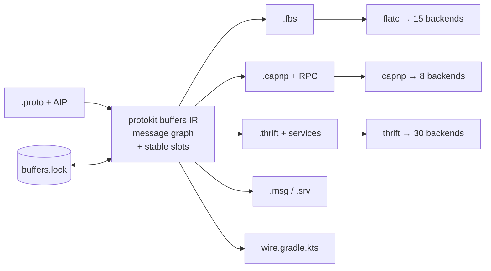
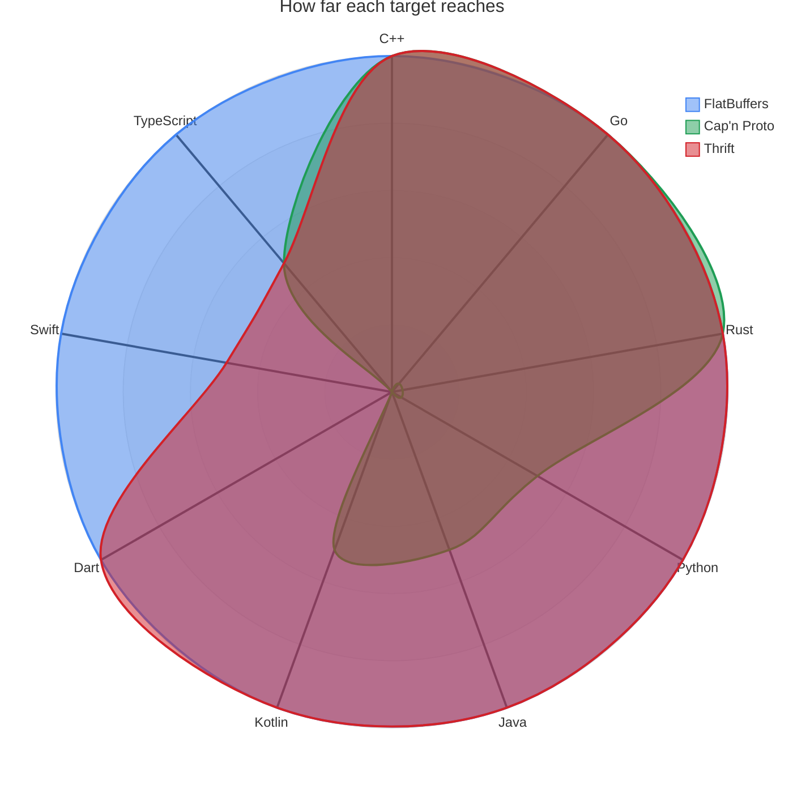
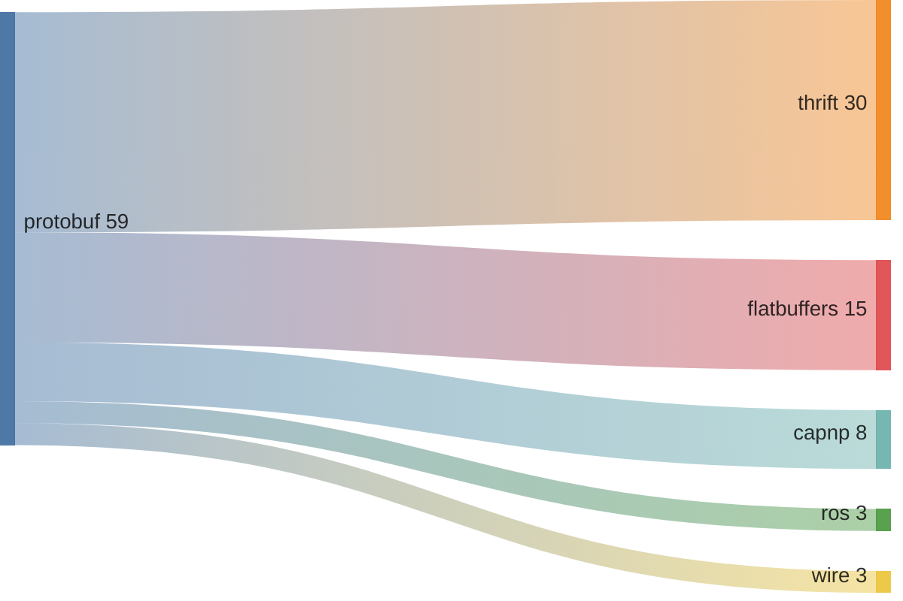
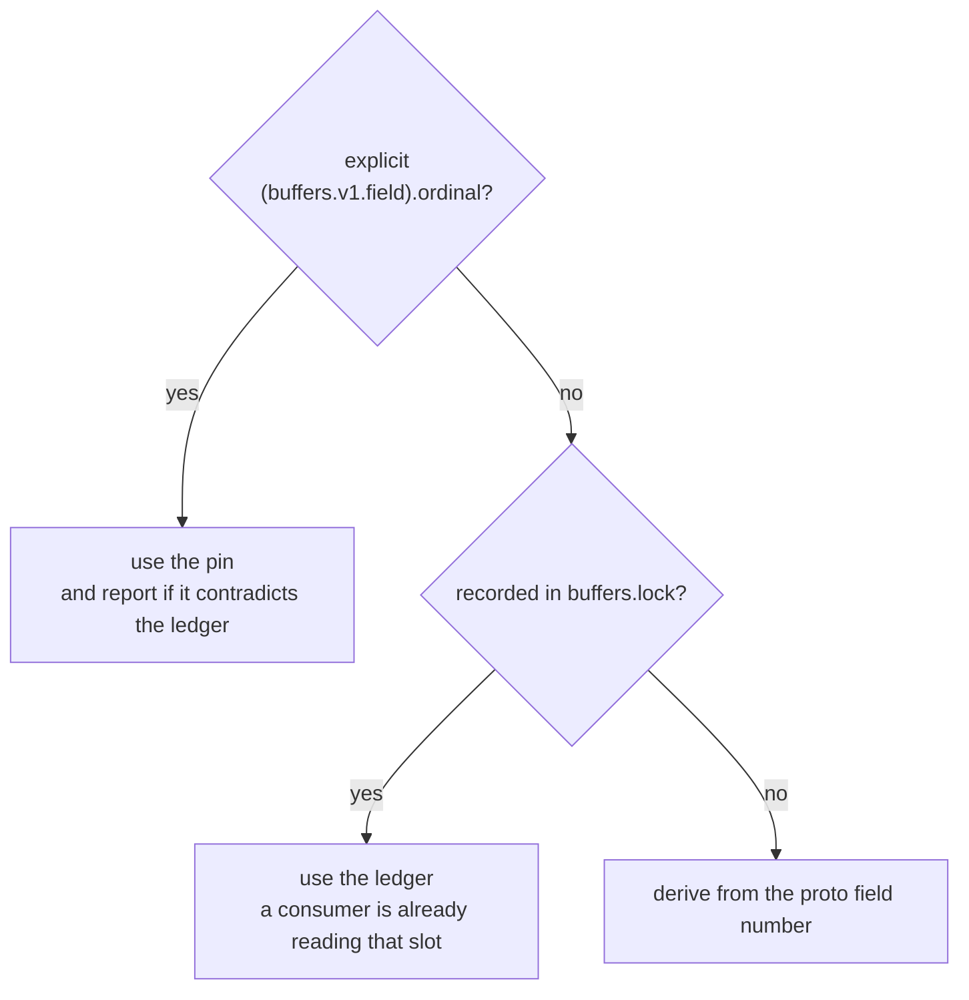
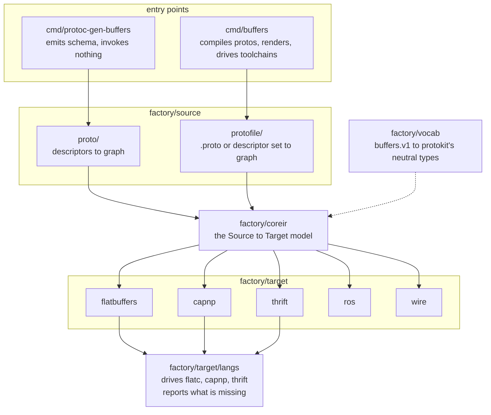

<h1 align="center">buffers</h1>

<p align="center">
  <strong>One AIP schema, every serialization surface.</strong> buffers is a
  <code>protoc</code> plugin and CLI that turns the AIP-annotated protobuf you
  already have into <strong>FlatBuffers</strong>, <strong>Cap'n Proto</strong>
  (with RPC), <strong>Apache Thrift</strong>, <strong>ROS 2</strong> and
  <strong>Square Wire</strong> — and pins every field to a target slot that does
  not move.
</p>

<p align="center">
  <a href="LICENSE"></a>
  
  
</p>

> [!CAUTION]
> Early development. The generated output may change between versions. Pin a
> release tag in CI, commit `buffers.lock`, and review the diff before shipping a
> regenerated schema.

## Contents

- [Why](#why)
- [The problem it actually solves](#the-problem-it-actually-solves)
- [Install](#install)
- [Quick start](#quick-start)
- [Targets](#targets)
- [Annotations](#annotations)
- [The ordinal ledger](#the-ordinal-ledger)
- [Architecture](#architecture)
- [What it does not do](#what-it-does-not-do)
- [Development](#development)

## Why

**Most systems of any size end up speaking more than one serialization format,
and almost none of them chose to.** A service boundary is gRPC because that is
what the platform gave you. A hot path is FlatBuffers or Cap'n Proto because
parsing showed up in a profile and zero-copy was the fix. An older internal
service is Thrift because it was written before protobuf won. A mobile client
wants a small JVM runtime. A robot or a vehicle carries ROS because that is what
the hardware vendor shipped.

Each of those has its own IDL. The usual answer is to write the same types five
times and hope review catches the drift — and review does not catch it, because
the drift that matters is not a renamed field, it is a field that quietly moved
to a different slot.

buffers takes the protobuf definition as the source of truth and derives the rest.
The AIP annotations that are already there — `google.api.resource`,
`field_behavior`, `resource_reference`, the AIP-131–136 method shapes — carry
enough information to do it without a second vocabulary describing the same
things again.

Nothing here is domain-specific. It is a schema-to-schema compiler: whatever your
`.proto` describes — orders, telemetry, ledger entries, documents — is what comes
out the other side. ROS is one of five backends, not the point of the tool.



## The problem it actually solves

Converting between IDLs is the easy half. The hard half is that **a field's slot
is a wire format, and the numbering schemes do not match.**

Proto field numbers are 1-based and sparse. Cap'n Proto ordinals are 0-based and
contiguous. FlatBuffers ids are 0-based, contiguous, and consumed *two at a time*
by a union. So every target needs a mapping — and a mapping recomputed from
scratch on each run silently changes when somebody deletes a field:

```proto
message Order {
  string id          = 1;   // ordinal 0
  OrderState state   = 2;   // ordinal 1
  string coupon_code = 5;   // ordinal 4   ← delete this
  double total       = 7;   // ordinal 5
}
```

Remove `coupon_code` without reserving it and `total` slides from ordinal 5 to 4.
Nothing reports it. Not protoc, not capnp, not flatc, not the consumer — which was
compiled against the old schema and now reads a `double` out of the slot that used
to hold a string.

buffers makes that visible three ways:

1. **Reserved ranges hold slots.** `reserved 5;` keeps ordinal 4 occupied, so
   nothing after it moves.
2. **An unreserved gap is a diagnostic** that names the exact line to add.
3. **`buffers.lock` records every assignment**, and `buffers verify` fails CI when
   a rebuild would move one.

```console
$ buffers verify
error: ordinal: billing.v1.Order.total: buffers.lock records ordinal 6 for
       field number 7, but this build derives 5; the ledger wins, because a
       consumer compiled against 6 is still reading it
    fix: a field was probably removed without a `reserved` declaration — add it,
         and the two will agree again
```

## Install

```sh
go install github.com/the-protobuf-project/buffers/plugin/cmd/protoc-gen-buffers@latest
go install github.com/the-protobuf-project/buffers/plugin/cmd/buffers@latest
```

Emitting schema needs nothing else. Compiling that schema *into a language*
additionally needs the format's own toolchain — flatc, capnp or thrift — and
`buffers doctor` reports which of them you have and gives one install line for the
package manager you actually use.

## Quick start

### As a buf plugin

```yaml
# buf.gen.yaml
version: v2
plugins:
  - local: protoc-gen-buffers
    out: schema/capnp
    opt:
      - target=capnp          # flatbuffers | capnp | ros | wire
      - lock=buffers.lock     # the ordinal ledger; commit it
      - strict=ordinal:error  # fail the build when a slot moves
```

### As a CLI

The CLI does strictly more: it compiles the protos itself, renders every target in
one pass, and drives flatc and capnp afterwards.

```sh
buffers init                    # write a starter buffers.yaml
buffers generate                # render every configured target
buffers generate --lang cpp     # ... and compile the schema
buffers verify                  # CI: fail if a slot would move
buffers targets                 # what can be emitted, what is installed
```

Point it at a buf-built descriptor set whenever the protos depend on anything buf
resolves — googleapis, a BSR module — because buf has already done the resolution:

```sh
buf build proto -o descriptors.binpb --as-file-descriptor-set
```

## Targets

| Target | Emits | Toolchain | Languages |
|---|---|---|---|
| `flatbuffers` | `.fbs` | `flatc` | **cpp, csharp, dart, go, java, kotlin, kotlin-kmp, lobster, lua, nim, php, python, rust, swift, ts** |
| `capnp` | `.capnp` + RPC interfaces | `capnp` + a `capnpc-<lang>` plugin | c++, go, rust, java, kotlin, python, ts, csharp |
| `thrift` | `.thrift` + services | `thrift` | **c_glib, cl, cpp, d, dart, delphi, erl, go, gv, haxe, html, java, javame, js, json, kotlin, lua, markdown, mmd, netstd, ocaml, perl, php, py, rb, rs, st, swift, xml, xsd** — see the version note below |
| `ros` | `.msg`, `.srv`, `topics.yaml` | rosidl, via colcon | c, cpp, python |
| `wire` | `wire.gradle.kts`, `Topics.kt` | Wire, via Gradle | kotlin, java, swift |

### Picking a target for a language

`buffers targets` prints this for your machine, and `buffers doctor` prints what
is missing and the exact command to install it.



Two means the generator runs and produces code, one means it works with a caveat
worth reading below, zero means no generator exists. `ros` and `wire` are left off
the radar because they are narrow by design rather than by limitation — ros
reaches C++ and Python through colcon, wire reaches Java, Kotlin and Swift through
Gradle — and plotting two mostly-empty shapes would say less than that sentence
does.

FlatBuffers is the only shape that closes, which is why it is the one to reach for
when a project spans every client you have.

Everything below was earned against this repository's own emitted schema rather
than read off a feature list, though not all of it the same way:

- **Generated backends** — every cell but Python under `capnp` — were verified by
  invoking the generator and checking it produced files.
- **`capnp` with Python is runtime-loaded**, so there is nothing to invoke. It was
  verified by loading the emitted `.capnp` with pycapnp and round-tripping a
  message: the schema parsed, a `Sensor` wrote to 80 bytes and read back intact,
  and the `payload` oneof arrived as a union.
- **TypeScript was typechecked, not just generated**, because producing files is
  the part that was already passing. Both toolchains write cross-file imports as
  paths, and a path is exactly what an exit code does not check: `flatc --ts` and
  `capnpc-ts` each exit 0 on output whose imports resolve to nothing. So the
  claim above is `tsc --strict` over a module that imports the deepest generated
  type, which pulls the whole tree in through those imports and fails if any of
  them is wrong. `TestGeneratedTypeScriptCompiles` runs it.

| Language | `flatbuffers` | `capnp` | `thrift` | `ros` | `wire` |
|---|---|---|---|---|---|
| **C++** | yes | yes, built in | yes | yes | – |
| **Go** | yes | yes, `capnpc-go` | yes | – | – |
| **Rust** | yes | yes, `capnpc-rust` | yes, `rs` | – | – |
| **Python** | yes | yes, runtime-loaded | yes, `py` | yes | – |
| **Java** | yes | yes, without interfaces | yes | – | yes |
| **Kotlin** | yes | yes, via `capnpc-java` | yes | – | yes |
| **Dart** | yes | no generator exists | yes | – | – |
| **Swift** | yes | no generator exists | varies by version | – | yes |
| **TypeScript** | yes | one-directory schemas only | yes, `js:ts` | – | – |

Five cells carry a caveat — four situations, since Java and Kotlin hit the same
one — and `buffers` reports each rather than letting you meet it as a crash:

- **Python needs no Cap'n Proto generator, and none exists.** pycapnp loads the
  schema when your program starts — `capnp.load("sensors/v1/sensors.capnp")` — so
  the emitted `.capnp` *is* the deliverable. `--lang python` says so and compiles
  nothing.
- **Thrift's generator set moves between releases.** Thrift 0.24 dropped the
  Swift generator and added Mermaid; the thrift Ubuntu currently packages is the
  other way round. Both are ordinary supported versions, so the language column
  above is a **superset** rather than a description of any one build. `buffers`
  asks the installed compiler what it actually has, and a language it lacks is
  reported with the set it does offer rather than as thrift's bare
  `Unable to get a generator`.
- **Java and Kotlin cannot carry the RPC interfaces.** capnproto-java is
  serialization-only and its plugin aborts on an interface with
  `failed: interfaces not implemented`, naming a line in its own C++. The build
  warns first, names the service, and points at
  `(buffers.v1.service).targets` — messages generate fine without it. Kotlin is
  the same path, since Cap'n Proto has no Kotlin generator and Kotlin consumes
  the Java output over JVM interop.
- **Cap'n Proto TypeScript resolves only from one directory.** Both generators —
  `capnpc-ts` and the maintained `capnp-es` fork — turn a Cap'n Proto import into
  a TypeScript one by making the schema's own path relative, and that path is
  relative to the *schema root* while capnp writes the file into the mirrored
  tree. The two coincide only at the root, so `sensors/v1/sensors.capnp`
  importing `/buffers/wellknown.capnp` emits
  `import { Timestamp } from "./buffers/wellknown.capnp.js"` into a file at
  `sensors/v1/`, and `tsc` reports `TS2307: Cannot find module`. The generator
  exits 0 either way, so `buffers` warns before it runs. Nothing in the schema
  can correct it: capnp picks the output path and the generator picks the import
  text, and neither sees the other. Take TypeScript from the FlatBuffers target,
  whose `--ts` output resolves across a nested tree.

The absent generators are upstream facts, not omissions here.
[Cap'n Proto's own list of implementations](https://capnproto.org/otherlang.html)
names no Swift, Dart or Kotlin implementation; the only `capnpc-swift` is an
[abandoned work in progress](https://github.com/Danappelxx/capnpc-swift). And
Thrift ships no Swift generator in 0.24 whatever its documentation suggests — the
language list above is transcribed from `thrift --help` and checked against the
installed binary by a test, because the first version of it was written from docs
and claimed two generators that do not exist while omitting one that does.

Wider than the table: `thrift` is the only target reaching Erlang, OCaml, Perl,
Ruby, D, Haxe or Common Lisp; `flatbuffers` is the only one reaching Nim or
Lobster; both reach C#, PHP and Lua.

TypeScript is spelled `ts` or `typescript` on either target. The FlatBuffers one
is the whole story — `flatc --ts` writes the namespace tree itself, so the output
lands beside your other generated code and cross-namespace imports resolve
against the output root. Thrift's is an option on its JavaScript backend rather
than a generator of its own: `--gen js:ts` writes `.d.ts` declarations alongside
the `.js`, services included. Naming `ts` as a thrift language does not reach it,
because that spelling selects a generator and thrift has none by that name.

FlatBuffers and Thrift are the two broad ones. Every entry in the FlatBuffers row
was verified by running `flatc` against this repository's own emitted schema;
every entry in the Thrift row is a generator built into the one `thrift` binary,
so unlike Cap'n Proto there is nothing extra to install per language.

How far one `.proto` reaches, by backend count:



The widths are generator backends, as `buffers targets` counts them, not a quality
ranking, and Thrift's is the superset across versions rather than any one build.
Seven of its 30 emit documentation or a schema description rather than a
language — GraphViz, HTML, Markdown, Mermaid, JSON, XML and XSD;
Cap'n Proto's eight are the ones that vary: C++ is built into `capnp` itself and
Python needs no generator at all, while the other six are separately installed
`capnpc-` plugins — five binaries, since Kotlin is served by `capnpc-java`.
Thrift's and FlatBuffers' are all built into the one binary. Reach is one axis —
what each format can actually *hold* is the next section, and it runs the other
way.

Cap'n Proto ships **only** its C++ generator; every other language is a separate
`capnpc-<lang>` binary you install. `buffers` checks for it before invoking capnp
and reports the install line rather than letting capnp fail with a bare exec
error.

### Getting the compilers

No compiler is needed to emit schema — `.fbs`, `.capnp`, `.thrift` and `.msg` are
written by `buffers` itself. They are needed only when a run asks for a language,
and `buffers doctor` reports which are present and gives one install line, chosen
for the package manager you actually have:

```console
$ buffers doctor
platform: linux/amd64   package manager: apt

TARGET       COMPILER  STATUS
flatbuffers  flatc     ok — flatc version 25.2.10
capnp        capnp     ok — Cap'n Proto version 1.0.2
thrift       thrift    NOT INSTALLED
ros          —         driven by colcon in the consuming build
wire         —         driven by Gradle in the consuming build

thrift (thrift):
  install: sudo apt-get install -y thrift-compiler
```

`buffers doctor --strict` exits non-zero when anything is missing, for a CI
preflight.

> **Why the compilers are not bundled into the binary.** flatc, capnp and thrift
> are all C++ programs — thrift's is a bison grammar over some fifty thousand
> lines — and Go cannot compile C++ into a Go binary. The two ways round it are
> both worse than a one-line install: vendoring the sources behind cgo would
> require a C++ toolchain to build `buffers` at all and end cross-compilation,
> and embedding prebuilt binaries would mean shipping three compilers × every
> supported platform inside every release, then keeping each one patched. So
> `buffers` shells out, and puts the effort into making a missing compiler report
> itself precisely rather than as an exec error.

### Output layout

Generated language code is laid out the way protoc lays out its own: paths
mirroring the proto source tree, and packages taken from the proto's own
`java_package` / `go_package` rather than the bare proto package.

One `proto/billing/v1/billing.proto` becomes:


The three that declare a package declare the one the proto asked for —
`billing::v1` for C++, `billingv1` for Go, `com.billing.v1` for Java — rather
than the bare proto package each generator would have derived on its own.

That takes per-directory invocation, because flatc is really two behaviours: Go,
Java, Kotlin and Python build a tree from the schema namespace, while C++, Rust,
Swift and Dart emit one flat file per schema with the namespace inside the file.
Left alone, the second group drops every schema in a tree into a single directory,
where same-named files collide. `buffers` compiles those per source directory and
passes `--keep-prefix` so the generated `#include`s still resolve across the
result — a tree that looks right but does not build is the failure mode here, and
there is a test that compiles it.

**The directory is the proto package, not the proto file.** This is the part that
surprises people reading the output for the first time, and it is worth being
explicit about because nothing in the tree hints at it. Every `.proto` in one
package generates into one directory, so four source files —
`sensors.proto`, `enums.proto`, `geometry.proto`, `sensors_service.proto`, all
declaring `package sensors.v1` — produce a single `sensors/v1/` holding every type
from all four, side by side. There is no `sensors/` and `enums/` beneath it. That
matches protoc, whose Go and Java output is likewise addressed by package rather
than by file. The ordinal ledger takes the same view: it identifies a message as
`sensors.v1.CreateSensorRequest`, package-qualified with no file component, so
moving a message between files in one package is not a change it records. Which
file a message was written in is an authoring detail consumers never see.

TypeScript shows this most plainly, because flatc writes one file per *type*
rather than per schema:

```
ts/
  sensors/
    v1.ts                       <- barrel: re-exports the whole package
    v1/
      sensor.ts                 <- from sensors.proto
      reading.ts                <- from sensors.proto
      sensor-kind.ts            <- from enums.proto
      health-state.ts           <- from enums.proto
      pose.ts                   <- from geometry.proto
      vector3.ts                <- from geometry.proto
      get-sensor-request.ts     <- from sensors_service.proto
      ...
  buffers/
    wellknown.ts
    wellknown/
      timestamp.ts
```

Twenty-odd files in `sensors/v1/` is the expected shape, not a missing grouping.
Import the barrel — `import { Sensor, Pose } from './sensors/v1.js'` — and the
per-type files stop mattering; they exist because flatc emits them that way, and
the names are kebab-cased from the type, so `CreateSensorRequest` becomes
`create-sensor-request.ts`. The cross-package import in `reading.ts` reaching
`'../../buffers/wellknown/timestamp.js'` is the reason the layout has to be exactly
this: those paths are written by flatc against the output root, so moving the tree
breaks them. See `langs/layout.go`.

**Go file names are snake_case.** flatc writes one file per generated *type*, in
PascalCase — `Order.go`, `CreateOrderRequest.go` — where Go uses lowercase
snake_case. `buffers` renames them afterwards, so you get `order.go` and
`create_order_request.go`.

The rename is safe because **a Go file name means nothing to the compiler**: the
package is declared inside the file and the type names are untouched, so
`Order.go` and `order.go` build identically. That is a Go-specific property, and
the rename is applied to Go alone — `Order.java` *must* contain `class Order`.

The one thing a Go file name does mean is a build constraint, which makes the
naive version of this actively dangerous:

| type | naive rename | effect |
|---|---|---|
| `OrderTest` | `order_test.go` | becomes a test file, excluded from the package |
| `OrderLinux` | `order_linux.go` | compiled only on Linux |
| `OrderAmd64` | `order_amd64.go` | compiled only on amd64 |

Each silently drops a type, with no error until something references it. A guard
word is appended in those cases (`order_test_fbs.go`), using protokit's
`naming.GoFileName`, which knows the constrained suffixes.

flatc's own `--gen-onefile` would give idiomatic names directly and is not used:
the Go it emits does not compile, because every file gets a fixed
`flatbuffers` + `strconv` import block regardless of content, so any schema
without tables or without enums fails on an unused import.

Two limits worth knowing, both flatc's:

- **Kotlin ignores the package option.** `--java-package-prefix` is Java-only, so
  Kotlin output declares the bare namespace and will not share a package with the
  Java output from the same schema. `buffers` warns rather than passing a flag
  that silently does nothing.
- **Go needs `go_module`.** flatc writes cross-package imports as bare namespace
  paths (`import "buffers/wellknown"`), which resolve against no module. Set
  `go_module` per generate entry — each target's Go output lives in its own
  directory, so one value cannot describe both.
- **`java_package` must end with the proto package.** flatc offers a prefix
  prepended to the namespace, not a package to set, so `com.billing.v1` over
  `billing.v1` works and `com.example.api` cannot be expressed. That is warned
  about too.

> **Why not emit into the same directory as your protobuf code?** Because they
> collide. `protoc-gen-go` and `flatc` both declare `type Order struct` in
> package `billingv1`, so the two cannot share a Go package — nor a Java package,
> nor a C++ namespace. Mirroring the tree gets the ergonomics without the
> collision: the output sits beside your protobuf output, one directory per
> encoding.

> **Cap'n Proto + Go** needs two things the schema does not otherwise carry.
> `capnpc-go` rejects any file without a `$Go.package` annotation, and its
> `$Go.import` must name where the generated file lands — which is the *schema*
> path under a module root, not what `option go_package` describes. Set
> `go_module` (the CLI config or the `go_module=` plugin opt) and both are emitted
> for you. A file declaring **only enums** additionally hits an upstream
> `capnpc-go` defect — it emits `capnp.EnumList` without importing `capnp` — which
> `buffers` warns about rather than letting you meet it as `undefined: capnp` in
> generated code.

### What each target has to decide

**FlatBuffers.** Every field gets an explicit `id:`, so the vtable layout is a
property of the schema rather than of declaration order. A union consumes *two*
ids — flatc synthesizes a hidden discriminant — and getting that wrong shifts
every later field by one. Maps become vectors of `(key)`-marked entry tables,
which preserves the lookup and not just the data. Oneofs become unions, with a
wrapper table per non-table arm since FlatBuffers unions may only hold tables.

**Cap'n Proto.** The closest fit: a proto oneof *is* a capnp union, and all six
integer widths exist. Identifiers are rewritten because capnp's grammar requires
a lowercase initial on members — `display_name` becomes `displayName`, exactly as
protojson already does. Every declaration carries a derived 64-bit ID so
regenerating an unchanged proto is byte-identical. Server-streaming methods become
a caller-supplied sink capability, which is the idiom, since capnp RPC has no
streaming return.

**Apache Thrift.** The one target where the slot mapping is the identity. A
Thrift field id is 1-based, sparse and permanent — which is exactly a proto field
number — so this target emits the proto number verbatim and **`buffers.lock` has
no authority over its output**. Deleting a field without reserving it cannot shift
anything here, because nothing slides down to fill the gap. Identifiers are left
alone for the same reason Cap'n Proto's are rewritten: Thrift's grammar demands no
case, so `display_name` stays `display_name` and `ORDER_STATE_SHIPPED` stays
itself.

It also has the only real `map<K,V>` of the five, so a proto map stays a map
rather than decaying into a list of pairs, and a oneof becomes a real `union`.

What it gives up: no unsigned integers (a `uint64` keeps its 64 bits and reads
back negative above the signed maximum — reported per field), no 32-bit float, no
streaming, and no nesting. Two further things are decided rather than derived.

**`required` is never emitted.** Thrift's `required` is a permanent wire contract
— a reader rejects any message lacking the field, forever — while AIP-203
REQUIRED is an API rule services relax routinely. Rendering one as the other would
freeze a decision the proto did not make, in a format where it cannot be unfrozen.

**A field number above 32767 is dropped, loudly.** This is the one place the
identity mapping breaks: a Thrift field id is a signed 16-bit integer, and a proto
field number runs to 536870911. Thrift does not refuse the overflow — it warns,
exits zero, and truncates the id into sixteen bits, which silently puts two fields
in one slot. buffers omits the field and reports it instead, because a schema
missing a field it names is recoverable and a schema writing two fields to one id
is not.

**ROS 2.** The lossiest, and the target that says so loudest. No enums (they
become constant-carrying messages), no unions (a oneof becomes a discriminant
constant block plus fields, and the build warns that nothing enforces it), no
maps, no optionals. What ROS has that nothing else here does is a **bound in the
type**: `float64[<=64]` is not `float64[]`, which is what
`(buffers.v1.field).max_len` exists for.

**Square Wire.** Emits no schema at all — Wire consumes `.proto` directly, so
copying it would only create a second copy to drift. What it emits is the wiring
Wire needs and proto does not supply: **tree-shaking roots derived from AIP**.
An API's reachable surface is exactly its services plus its resources, so the
roots list writes itself, with the justification on every line.

## Annotations

`buffers.v1` shapes how a proto lands in each target. It deliberately says nothing
about what anything is *called* — for a serialization schema the proto field name
is not a policy, it is the mapping.

```proto
import "buffers/v1/annotations.proto";

option (buffers.v1.file) = {
  namespace: "billing.v1"
  jvm_package: "com.billing.v1"
  file_id: "BILL"          // FlatBuffers file_identifier
};

message LatLng {
  option (buffers.v1.message) = {layout: LAYOUT_STRUCT};  // packed, not evolvable

  double latitude = 1;
  double longitude = 2;
}

enum OrderState {
  option (buffers.v1.enumeration) = {underlying: INT_WIDTH_UINT8};  // one byte, not four
  ORDER_STATE_UNSPECIFIED = 0;
  ORDER_STATE_SHIPPED = 1;
}

message Order {
  reserved 6;  // holds the slot of a removed field — see below

  string currency_code = 5 [(buffers.v1.field) = {max_len: 3}];  // ISO 4217; ROS: string<=3
}
```

| Option | Applies to | What it decides |
|---|---|---|
| `namespace`, `ros_package`, `jvm_package` | file | per-target package names |
| `file_id`, `file_extension` | file | FlatBuffers `file_identifier` / `file_extension` |
| `capnp_id` | file, message, service | pins a Cap'n Proto ID when adopting an existing schema |
| `layout` | message | `LAYOUT_STRUCT` for a packed, fixed-size record |
| `fbs_root` | message | the FlatBuffers `root_type` |
| `ordinal` | field, enum value, method | pins a slot — for adoption only |
| `max_len`, `fixed_len` | field | ROS array and string bounds |
| `key`, `shared` | field | FlatBuffers `(key)` / `(shared)` |
| `capnp_group` | field | folds fields into a Cap'n Proto `group` |
| `underlying`, `bit_flags` | enum | FlatBuffers underlying width / bitmask |
| `transport`, `topic` | method | ROS service vs topic vs action |
| `skip`, `targets` | most | exclude, or restrict to named targets |

`LAYOUT_STRUCT` is **opt-in, never inferred.** A message of two doubles is
struct-eligible, and adding a string to it is an ordinary wire-compatible proto
change — but it would flip the message from packed to vtable-backed, which *is*
breaking in FlatBuffers. Packing trades evolution for density, so it is opted into
rather than fallen into.

## The ordinal ledger

`buffers.lock` records the slot every field was assigned, keyed by proto field
number.

Keyed by **number**, not name: renaming a proto field is not a wire change, and a
ledger keyed by name would read a rename as a delete-plus-add and hand the field a
fresh ordinal — inventing a breaking change out of a compatible one.

```yaml
messages:
  - message: billing.v1.Order
    fields:
      - number: 1
        ordinal: 0
        name: id
      - number: 7
        ordinal: 6
        name: total      # 5 is held by `reserved 6;`
```

Commit it. Run `buffers verify` in CI. `.gitattributes` marks it `-merge`, because
a conflict here is a real conflict about wire compatibility and resolving it
textually would let git pick a winner.

Precedence when the three sources disagree:



A pin outranks the ledger — it is the escape hatch for adopting a `.capnp` that
predates this plugin — but a pin that contradicts the ledger is *reported*,
because noticing a slot moving is the ledger's entire job.

**Thrift is exempt, and the exemption is worth understanding.** The ledger exists
because Cap'n Proto ordinals and FlatBuffers ids are 0-based and contiguous, so a
deleted field drags everything after it down one. Thrift ids are 1-based, sparse
and permanent — the same scheme proto uses — so `buffers` emits the proto field
number unchanged and nothing can shift. `buffers.lock` still records the ordinals
the other targets are rendered from; it simply has no say over a `.thrift`, which
is why those files' banners do not send you to it.

## Architecture

Built on [protokit](https://github.com/the-protobuf-project/protokit), the same
IR engine behind [store](https://github.com/the-protobuf-project/store) and
[cache](https://github.com/the-protobuf-project/cache), and laid out the same way.


`protobuf/buffers/v1` is the vocabulary, published as a BSR module. `cmd/` holds
the two entry points, `factory/` the machinery they share. How a run moves
through it:



`factory/registry` is what wires the sources and targets together, and where the
golden tests live.

**Why a third IR rather than protokit's other two.** The message graph this
plugin renders from lives in protokit as `protokit/buffers`, alongside the schema
IR and the service IR. It is a third frontend rather than a use of either, because
both fail for a serialization target in ways configuration cannot fix. The schema
IR folds messages into databases and tables — right for a generator that stores
things, wrong here: it keeps only resources and what is reachable from them, so a
plain value type like `Money` or `LatLng` has no representation, while a `.fbs`
that omits it does not compile. It also collapses the four 64-bit widths into
one neutral type, which a
database is right to do and a serialization schema is not. The service IR is
closer, but only materializes messages reachable from a method — and a `.proto` of
pure messages with no service is the most common input a serialization plugin
gets. A schema that disappears when you delete the service is not a schema.

What stays in this repository is the vocabulary: `buffers.v1`, and the
`plugin/factory/vocab` reader that spells it in protokit's neutral types. protokit
imports no annotation module, so the options reach the IR through that seam rather
than through an import.

What protokit supplies beyond the IR: naming, the reproducible banner, the
template helper, the manifest schema, and the factory's `Source`/`Target`/`Registry`.

## What it does not do

**The plugin never shells out.** `protoc-gen-buffers` emits schema and stops.
Running flatc from inside a protoc plugin would hand that compiler's availability,
exit codes and latency to everyone who only wanted a descriptor pass. Everything
needing a subprocess lives in the CLI.

**`option go_package` is not required.** protogen — the library every protoc
plugin builds on — refuses a request whose generated files declare no Go import
path. That is right for `protoc-gen-go` and wrong here: a `.proto` that will only
ever be compiled to FlatBuffers or Thrift has no reason to name a Go
package. `buffers` supplies one out of
band so the request builds, while leaving the descriptor untouched, so the
Cap'n Proto target still knows the option is absent and says so rather than
inventing a `$Go.package`.

**It does not rename anything.** Other protokit plugins read `entity.v1` so two
generators agree on what a table is *called*. buffers does not, because for a
serialization schema the proto name is not a naming policy — it is the mapping,
and renaming a field on its way into a `.capnp` would break the correspondence
between what a producer writes and what a consumer reads.

**eCAL is not wired yet.** The ROS target already emits `topics.yaml` — the
topic-to-message binding that exists nowhere in any IDL — which is what eCAL
publisher and subscriber generation will read. An eCAL channel and a ROS topic are
the same idea under two names.

## Development

The example protos under `examples/proto` model a sensor API. That is a fixture
choice, not a statement about scope: it exercises bounded arrays, a oneof, a map,
a streaming method and a packed struct in one tree, which is most of the hard
cases in one place. Nothing in the plugin knows what a sensor is.

```sh
just ci          # lint, build, test — mutates nothing
just aip         # api-linter over every proto here; zero findings, no suppressions
just test        # unit + golden + toolchain tests
just golden      # rewrite the goldens after an intentional change
just examples    # render examples/ with the build under test
just langs       # ... and compile it with the real flatc and capnp
```

The test suite makes two separate claims. The **golden tests** assert the output
has not changed. The **toolchain tests** assert it is valid — running the real
`flatc` and `capnp` over every emitted file, because a schema can be byte-stable
and still not compile.

CI runs the same checks (`Test`, `Lint`), and Dependabot pull requests merge
themselves once all of them pass — see [.github/AUTOMATION.md](.github/AUTOMATION.md)
for how that gate works and why it does not use GitHub's native auto-merge.

Both the vocabulary and the examples pass
[api-linter](https://github.com/googleapis/api-linter) with no rules disabled: a
tool that generates schema *from* AIP-shaped protos should not hold its users to a
bar it ducks.

## License

Apache-2.0.
